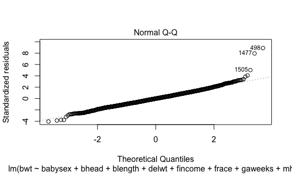
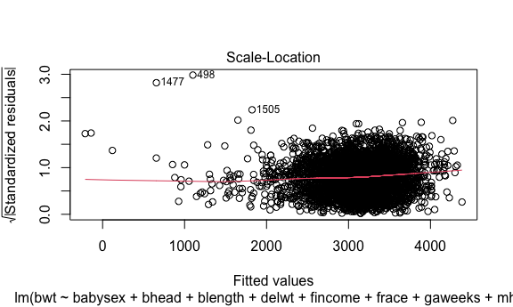

p8105 HW6 - Sara Kramer (sk4970)
================

# Problem 1

To obtain a distribution for $\hat{r}^2$, we’ll follow basically the
same procedure we used for regression coefficients: draw bootstrap
samples; the a model to each; extract the value I’m concerned with; and
summarize. Here, we’ll use `modelr::bootstrap` to draw the samples and
`broom::glance` to produce `r.squared` values.

``` r
weather_df = 
  rnoaa::meteo_pull_monitors(
    c("USW00094728"),
    var = c("PRCP", "TMIN", "TMAX"), 
    date_min = "2017-01-01",
    date_max = "2017-12-31") %>%
  mutate(
    name = recode(id, USW00094728 = "CentralPark_NY"),
    tmin = tmin / 10,
    tmax = tmax / 10) %>%
  select(name, id, everything())
```

    ## Registered S3 method overwritten by 'hoardr':
    ##   method           from
    ##   print.cache_info httr

    ## using cached file: ~/Library/Caches/R/noaa_ghcnd/USW00094728.dly

    ## date created (size, mb): 2022-09-14 18:02:47 (8.401)

    ## file min/max dates: 1869-01-01 / 2022-09-30

``` r
weather_df %>% 
  modelr::bootstrap(n = 1000) %>% 
  mutate(
    models = map(strap, ~lm(tmax ~ tmin, data = .x) ),
    results = map(models, broom::glance)) %>% 
  select(-strap, -models) %>% 
  unnest(results) %>% 
  ggplot(aes(x = r.squared)) + geom_density()
```


In this example, the $\hat{r}^2$ value is high, and the upper bound at 1
may be a cause for the generally skewed shape of the distribution. If we
wanted to construct a confidence interval for $R^2$, we could take the
2.5% and 97.5% quantiles of the estimates across bootstrap samples.
However, because the shape isn’t symmetric, using the mean +/- 1.96
times the standard error probably wouldn’t work well.

We can produce a distribution for $\log(\beta_0 * \beta1)$ using a
similar approach, with a bit more wrangling before we make our plot.

``` r
weather_df %>% 
  modelr::bootstrap(n = 1000) %>% 
  mutate(
    models = map(strap, ~lm(tmax ~ tmin, data = .x) ),
    results = map(models, broom::tidy)) %>% 
  select(-strap, -models) %>% 
  unnest(results) %>% 
  select(id = `.id`, term, estimate) %>% 
  pivot_wider(
    names_from = term, 
    values_from = estimate) %>% 
  rename(beta0 = `(Intercept)`, beta1 = tmin) %>% 
  mutate(log_b0b1 = log(beta0 * beta1)) %>% 
  ggplot(aes(x = log_b0b1)) + geom_density()
```


As with $r^2$, this distribution is somewhat skewed and has some
outliers.

The point of this is not to say you should always use the bootstrap –
it’s possible to establish “large sample” distributions for strange
parameters / values / summaries in a lot of cases, and those are great
to have. But it is helpful to know that there’s a way to do inference
even in tough cases.

# Problem 2

``` r
# importing and cleaning data frame. Includes: creating city, state variable, a binary variable if solved or unsolved, fixing an error with one of the city, states, updating variables to appropriate types.
homicide_df = 
  read_csv("data-homicides-master/homicide-data.csv") %>% 
  janitor::clean_names() %>%
  mutate(city_state = as.factor(str_c(city, state, sep = ", ")),
         solved = as.logical(ifelse(disposition %in% c("Closed by arrest"), TRUE, FALSE)),
         reported_date = as.Date(as.character(reported_date),"%Y%m%d"),
         victim_age = as.numeric(victim_age),
         victim_first = str_to_title(victim_first),
         victim_last = str_to_title(victim_last),
         victim_sex = as.factor(victim_sex),
         victim_race = as.factor(victim_race),
         city = as.factor(city),
         state = as.factor(state)) %>%
  filter(city_state != "Dallas, TX" & city_state != "Phoenix, AZ" & city_state != "Kansas City, MO" & city_state != "Tulsa, AL") %>%
  filter(victim_race == "White" | victim_race == "Black")
```

    ## Rows: 52179 Columns: 12
    ## ── Column specification ────────────────────────────────────────────────────────
    ## Delimiter: ","
    ## chr (9): uid, victim_last, victim_first, victim_race, victim_age, victim_sex...
    ## dbl (3): reported_date, lat, lon
    ## 
    ## ℹ Use `spec()` to retrieve the full column specification for this data.
    ## ℹ Specify the column types or set `show_col_types = FALSE` to quiet this message.

``` r
# glm for baltimore
balt = 
  homicide_df %>%
  filter(city_state ==  "Baltimore, MD")

  balt_glm = glm(solved ~ victim_age + victim_sex + victim_race, data = balt, family = "binomial") 
  
balt_output =
  balt_glm %>% 
  tidy(exponentiate = TRUE, conf.int = TRUE, conf.level = 0.95) %>%
  filter(term == "victim_sexMale") %>%
  select(term, "adjusted_OR" = "estimate", "CI_lower" = "conf.low", "CI_upper" = "conf.high")

# for all cities
city_glm = 
 homicide_df %>%
 nest(data = -city_state) %>% 
  mutate(
    models = map(data, ~glm(solved ~ victim_age + victim_sex + victim_race, family = "binomial", data = .x)),
    exp_results = map(models, tidy, exponentiate = TRUE, conf.int = TRUE, conf.level = 0.95)) %>%
  select(-data, -models) %>% 
  unnest(exp_results) %>%
  filter(term == "victim_sexMale") %>%
  select(city_state, 
         term, 
         "adjusted_OR" = "estimate", 
         "CI_lower" = "conf.low",
         "CI_upper" = "conf.high")
city_glm
```

    ## # A tibble: 47 × 5
    ##    city_state      term           adjusted_OR CI_lower CI_upper
    ##    <fct>           <chr>                <dbl>    <dbl>    <dbl>
    ##  1 Albuquerque, NM victim_sexMale       1.77     0.825    3.76 
    ##  2 Atlanta, GA     victim_sexMale       1.00     0.680    1.46 
    ##  3 Baltimore, MD   victim_sexMale       0.426    0.324    0.558
    ##  4 Baton Rouge, LA victim_sexMale       0.381    0.204    0.684
    ##  5 Birmingham, AL  victim_sexMale       0.870    0.571    1.31 
    ##  6 Boston, MA      victim_sexMale       0.674    0.353    1.28 
    ##  7 Buffalo, NY     victim_sexMale       0.521    0.288    0.936
    ##  8 Charlotte, NC   victim_sexMale       0.884    0.551    1.39 
    ##  9 Chicago, IL     victim_sexMale       0.410    0.336    0.501
    ## 10 Cincinnati, OH  victim_sexMale       0.400    0.231    0.667
    ## # … with 37 more rows

``` r
# creating a plot to show the estimated ORs and CIs
  city_glm %>%
  ggplot(aes(x = reorder(city_state, +adjusted_OR), y = adjusted_OR)) +
  geom_point(show.legend = FALSE) +
  geom_errorbar(aes(ymin = CI_lower, ymax = CI_upper)) +
  theme(axis.text.x = element_text(angle = 90)) +
  labs(
    title = "Adjusted OR for homicide resolution comparing male victims to female victims",
    x = "City",
    y = "Adjusted OR")
```


``` r
  # The plot suggests that after adjusting for victim age and race, homicides where the victim is female has higher odds of being solved compared to homicides with a male victim in many of the cities.
```

# Problem 3

``` r
# importing and cleaning data frame including making necessary variables character variables and removing missing data
birthweight_df = 
  read_csv("./birthweight.csv") %>% 
  janitor::clean_names() %>%
  mutate(
    babysex = as.factor(babysex),
    babysex = fct_recode(babysex, "male" = "1", "female" = "2"),
    frace = as.factor(frace), 
    frace = fct_recode(frace, "white" = "1", "black" = "2", "asian" = "3", "puerto rican" = "4", "other" = "8"),
    malform = as.logical(malform),
    mrace = as.factor(frace), 
    mrace = fct_recode(mrace, "white" = "1", "black" = "2", "asian" = "3", "puerto rican" = "4")
  ) %>%
  na.omit()
```

    ## Rows: 4342 Columns: 20
    ## ── Column specification ────────────────────────────────────────────────────────
    ## Delimiter: ","
    ## dbl (20): babysex, bhead, blength, bwt, delwt, fincome, frace, gaweeks, malf...
    ## 
    ## ℹ Use `spec()` to retrieve the full column specification for this data.
    ## ℹ Specify the column types or set `show_col_types = FALSE` to quiet this message.

``` r
  # checking for missing data and anything unusual 
  colSums(is.na(birthweight_df))
```

    ##  babysex    bhead  blength      bwt    delwt  fincome    frace  gaweeks 
    ##        0        0        0        0        0        0        0        0 
    ##  malform menarche  mheight   momage    mrace   parity  pnumlbw  pnumsga 
    ##        0        0        0        0        0        0        0        0 
    ##    ppbmi     ppwt   smoken   wtgain 
    ##        0        0        0        0

``` r
  lapply(birthweight_df, unique)
```

    ## $babysex
    ## [1] female male  
    ## Levels: male female
    ## 
    ## $bhead
    ##  [1] 34 36 33 35 38 32 37 30 31 24 29 28 27 22 26 39 41 21 23 25
    ## 
    ## $blength
    ##  [1] 51 48 50 52 46 49 53 56 57 63 54 55 42 47 45 58 37 44 20 60 43 32 40 39 41
    ## [26] 38 33 31 36
    ## 
    ## $bwt
    ##   [1] 3629 3062 3345 3374 2523 2778 3515 3459 3317 3175 3544 2551 3232 3203 2977
    ##  [16] 3685 2948 3289 3118 3402 3827 3799 3856 3005 3600 3147 3033 3487 2920 2013
    ##  [31] 2381 4224 3090 3912 3430 2438 3969 2211 3572 2722 2835 4791 2693 2863 2637
    ##  [46] 2665 2580 3884 2126 2750 2892 3657 4082 3742 2098 2325 1049 2608 4252 3714
    ##  [61] 3770 3997 4054 2353 1814 3260 2183 2495 4111 2410 2070 1899 2466 4281 2296
    ##  [76] 3941 2807 2041 4026 4167 4451 4196 2155 1956 1928 2268 1474 4139 1871 4706
    ##  [91] 4593 1276 1616 1503 1701 1758 2240 1729 1843 1673 1191  680 4337 1786 1219
    ## [106] 1644 1559 1361 1106 1446 4508 4309 4366 4564 4649 1417  907  595  624 1588
    ## [121] 1332 2830 4394 1304 1247 1389 1984 1531 1162 4423
    ## 
    ## $delwt
    ##   [1] 177 156 148 157 129 126 140 146 169 130 158 147 120 154 127 134 135 170
    ##  [19] 143 152 145 161 112 167 171 149 141 155 121 142 128 150 136 165 168 132
    ##  [37] 172 139 123 178 137 189 115 160 190 173 138 182 124 144 131 118 175 125
    ##  [55] 133 176 195 159 151 116  96 166 174 122 162 117 119 201 187 104 215 184
    ##  [73] 163 153 206 183 179 107 100 180 185 204 114 164 102 192 186 196 193 202
    ##  [91] 225 113 191 111 181 205 211  99 198 110 214 238 188 209 220  95 106 197
    ## [109] 200 265 207 242 240 108 109 203  97 213 227 216 231 221 105 248 229 194
    ## [127] 212  98 210 260 237 234 236 218 245 103 230 199 232  86 101 243 334 208
    ## [145]  92 226 217 262 235 256 219 249 254 286
    ## 
    ## $fincome
    ##  [1] 35 65 85 55  5 96 75 45 25 95 15  0
    ## 
    ## $frace
    ## [1] white        black        asian        puerto rican other       
    ## Levels: white black asian puerto rican other
    ## 
    ## $gaweeks
    ##   [1] 39.9 25.9 40.0 41.6 40.7 40.3 37.4 43.4 39.4 39.7 41.3 39.6 38.1 42.1 41.1
    ##  [16] 40.6 41.7 41.9 41.0 38.9 38.0 40.1 40.4 39.3 42.3 42.7 38.6 42.6 43.7 37.7
    ##  [31] 34.7 37.9 40.9 41.4 39.0 30.4 38.4 44.6 35.9 47.7 35.1 38.7 38.3 37.3 35.0
    ##  [46] 35.7 36.4 36.3 30.6 36.9 37.0 42.0 35.6 39.1 48.3 46.0 27.1 35.3 43.1 37.1
    ##  [61] 43.0 34.3 42.4 33.6 33.4 46.4 44.7 44.1 45.3 36.7 36.6 48.4 31.3 37.6 33.1
    ##  [76] 49.1 34.1 45.7 45.0 36.1 42.9 43.3 36.0 34.6 46.3 44.0 47.3 44.9 49.3 28.4
    ##  [91] 43.6 32.3 34.9 30.1 44.4 34.0 33.9 32.4 45.1 32.0 28.1 31.0 48.7 28.3 33.7
    ## [106] 27.9 45.9 32.1 46.6 35.4 34.4 17.7 29.9 44.3 45.6 50.7 28.9 32.7 24.1 23.9
    ## [121] 49.0 46.7 49.9 47.1 31.9 45.4 27.7 28.6 43.9 28.0 30.3 20.1 33.0 47.0 29.3
    ## [136] 50.9 47.9 20.3 31.1 29.7 25.0 26.6 20.4 30.0 27.0 18.7 31.7 26.9 29.1 31.6
    ## [151] 27.4 32.9 47.4 46.1 26.4 25.7 26.0 25.4 19.6 27.6 29.0 31.4 30.7 33.3 24.0
    ## [166] 51.3 19.0 26.1 22.1 28.7 29.6 26.7 49.4 46.9 32.6
    ## 
    ## $malform
    ## [1] FALSE  TRUE
    ## 
    ## $menarche
    ##  [1] 13 14 12 11 10 15 17  8 16 18  9 19  5  0
    ## 
    ## $mheight
    ##  [1] 63 65 64 66 72 62 61 67 68 69 77 59 57 60 58 70 56 52 55 71 53 75 50 54 51
    ## [26] 48
    ## 
    ## $momage
    ##  [1] 36 25 29 18 20 23 19 13 16 28 21 27 24 17 22 26 30 33 42 32 39 35 31 40 37
    ## [26] 38 41 34 15 43 14 12 44
    ## 
    ## $mrace
    ## [1] white        black        asian        puerto rican other       
    ## Levels: white black asian puerto rican other
    ## 
    ## $parity
    ## [1] 3 0 1 6
    ## 
    ## $pnumlbw
    ## [1] 0
    ## 
    ## $pnumsga
    ## [1] 0
    ## 
    ## $ppbmi
    ##   [1] 26.27184 21.34485 23.56517 21.84508 21.02642 18.60030 14.27034 21.81089
    ##   [9] 19.88106 24.94123 17.26446 21.07775 23.22115 19.19829 19.24491 17.20085
    ##  [17] 21.44432 23.73717 19.23779 17.82699 22.72121 22.01709 18.92094 20.16133
    ##  [25] 22.19744 18.58882 23.07662 13.07137 21.30149 19.24726 22.51215 16.49563
    ##  [33] 22.64384 21.50106 19.84404 23.34593 21.97295 19.78098 20.41393 19.60897
    ##  [41] 31.80969 17.71688 20.01080 20.29700 22.53312 22.91060 14.05838 19.70388
    ##  [49] 21.18820 28.40151 21.83513 20.40345 18.87834 18.74893 21.47901 21.16156
    ##  [57] 22.75770 21.99418 22.17863 18.99090 21.67837 19.63259 21.15705 24.61464
    ##  [65] 17.79159 23.51269 22.36111 20.34431 21.65652 21.81600 20.37946 19.79476
    ##  [73] 23.66793 16.85683 23.90918 18.52006 30.84998 27.83348 18.04921 16.65940
    ##  [81] 25.11194 18.89356 18.32848 19.67728 21.45753 22.89911 21.25134 17.21871
    ##  [89] 21.32906 27.33692 19.40900 19.17134 22.70512 20.12500 21.34991 20.84458
    ##  [97] 19.52637 25.56136 19.61870 22.72159 19.93260 21.77449 27.45480 20.54928
    ## [105] 23.68055 20.82778 20.21771 24.26126 22.50636 22.26376 21.03125 19.51053
    ## [113] 21.17809 18.94182 26.68144 18.69505 16.86368 19.26495 20.08955 19.14785
    ## [121] 21.99687 18.11507 21.67307 25.84728 17.39622 18.74500 18.93434 28.27403
    ## [129] 23.82703 20.23642 20.84883 22.01154 21.20646 19.22779 20.70294 22.15318
    ## [137] 20.67783 17.97935 24.74345 23.09990 19.43696 20.17756 18.63881 17.74847
    ## [145] 21.65657 20.05890 22.17746 26.02645 19.96216 23.09348 20.25975 25.73930
    ## [153] 19.34377 17.50945 24.19360 17.96191 19.06162 25.44197 19.17933 26.12939
    ## [161] 19.37504 23.93777 18.34323 20.94647 40.29532 22.87713 19.17702 20.41723
    ## [169] 25.97329 23.39316 19.57075 18.27681 22.44380 30.33466 23.47858 24.17024
    ## [177] 15.57921 20.44909 22.34252 18.92378 26.01404 24.17971 16.67566 18.57692
    ## [185] 19.80776 19.08552 23.01242 19.84234 19.95299 27.49609 28.64507 23.04914
    ## [193] 17.75124 20.54120 21.52782 17.92876 28.40915 22.48210 16.76041 25.01350
    ## [201] 20.51107 17.60894 32.04855 21.26104 17.88889 17.34269 20.64102 19.31303
    ## [209] 26.57630 20.71761 21.84512 37.52025 19.50303 19.97770 20.71735 20.71119
    ## [217] 21.62761 21.63617 22.09327 25.87867 18.84350 22.93736 26.31172 20.98504
    ## [225] 27.51485 16.43943 23.85727 23.38549 16.51282 18.84935 27.48315 22.18905
    ## [233] 18.17648 17.22877 26.69742 22.28685 30.73092 20.35358 23.54244 21.99091
    ## [241] 21.10426 24.65914 20.07040 21.65905 20.52790 24.85485 20.42165 17.75796
    ## [249] 18.10627 25.58279 31.77473 19.61148 18.23290 22.11494 22.36075 21.51161
    ## [257] 25.80128 28.40199 26.68738 24.37878 20.12991 27.18134 17.73531 29.11351
    ## [265] 20.46901 24.08119 21.13641 20.94372 18.67674 23.60915 19.04593 18.99383
    ## [273] 23.45255 22.85511 18.55565 26.42051 18.74119 22.54403 19.88139 19.50237
    ## [281] 23.96418 25.75009 17.41206 24.71359 20.23978 24.58474 21.02670 17.61367
    ## [289] 23.29318 27.22684 18.83396 21.51165 29.24145 31.68376 18.28378 20.89447
    ## [297] 18.40491 22.89777 22.34539 23.85354 31.30555 25.14062 23.61695 17.37286
    ## [305] 20.26486 31.99715 22.15861 22.91055 25.45726 22.72732 34.09098 26.02909
    ## [313] 22.66856 23.09389 21.58515 19.09295 16.27813 26.66132 22.18910 25.83339
    ## [321] 18.51177 23.17917 27.49272 25.71693 22.92904 19.73249 24.41719 23.78667
    ## [329] 23.46458 25.06996 29.82209 17.98763 18.43645 29.28955 24.32719 23.46046
    ## [337] 17.54487 21.33144 26.19298 24.99333 21.94091 18.78792 30.29495 30.99671
    ## [345] 23.48490 25.94005 21.78854 26.62687 29.27480 22.84566 24.56017 30.01620
    ## [353] 28.84403 18.20079 16.98288 16.75498 17.06515 19.98615 15.99679 19.12369
    ## [361] 24.14169 30.79185 22.87095 21.34515 17.04549 24.42521 17.59534 24.85174
    ## [369] 19.34886 23.43164 18.00972 24.31920 20.94070 23.28924 21.91924 17.02884
    ## [377] 20.76896 20.87430 24.37688 24.46343 21.83403 28.02283 20.64458 24.28774
    ## [385] 15.44358 19.89423 16.32276 18.28409 22.24564 16.34081 25.23171 24.48414
    ## [393] 26.31730 20.05597 22.32035 20.63843 21.01134 17.97313 23.67727 29.59097
    ## [401] 20.81303 29.34823 20.56960 27.52136 18.67701 23.00561 20.87433 18.06089
    ## [409] 22.34543 33.72736 22.01188 19.42819 26.68106 35.50249 19.26720 17.80217
    ## [417] 15.39023 20.74499 18.81632 23.12906 26.57756 16.17540 17.00918 19.83499
    ## [425] 30.61752 28.25093 33.35133 21.85897 34.52892 23.67945 17.57836 25.29973
    ## [433] 20.72197 18.98362 17.42141 22.54408 25.90246 25.20677 21.12398 20.41748
    ## [441] 28.33570 22.96732 27.51443 31.38993 41.28204 22.91464 33.96576 26.54579
    ## [449] 19.76645 19.01026 33.13510 19.46175 23.22854 27.73087 20.03739 15.14747
    ## [457] 25.89669 17.60861 17.04091 18.59221 20.15787 19.53375 27.46618 18.14520
    ## [465] 16.00864 29.18242 18.50999 14.55675 15.85069 19.43019 32.29173 36.12179
    ## [473] 20.59144 28.38140 24.67999 15.69496 20.11250 23.29081 18.16923 24.09951
    ## [481] 18.39650 27.86538 32.18838 28.30480 18.46129 18.17697 31.99358 21.96384
    ## [489] 17.77863 22.70207 15.84188 25.68052 16.09419 18.49787 19.97805 21.50210
    ## [497] 27.88323 21.15316 26.83333 16.63513 27.37685 42.65811 24.12122 17.57373
    ## [505] 23.64374 17.84296 34.61493 19.41099 28.95177 26.20216 27.17261 30.10149
    ## [513] 17.46810 22.80558 25.30509 17.41959 22.33559 17.20382 24.23596 24.92674
    ## [521] 25.38428 26.88677 17.95333 31.95224 28.09398 22.53187 30.17711 22.31065
    ## [529] 29.14529 29.06944 24.93779 20.16709 21.25177 22.36213 15.48077 38.70192
    ## [537] 25.75071 19.69172 18.21581 26.09433 16.79361 13.18377 33.74417 15.97612
    ## [545] 32.75641 17.67620 24.84674 36.68646 31.15842 19.89654 21.01712 18.63991
    ## [553] 23.88294 23.43657 23.27717 25.91682 27.01740 28.18797 27.72850 26.22480
    ## [561] 28.13330 15.23674 24.04661 28.79744 33.27332 36.80982 26.48931 24.08528
    ## [569] 18.00509 23.45697 20.10597 28.19055 27.00763 28.74049 17.79828 20.12568
    ## [577] 15.84621 29.32557 36.84025 16.49765 24.89493 17.30636 17.62985 16.34215
    ## [585] 16.66222 22.78938 24.79804 19.68173 23.31221 16.63666 16.95056 28.72542
    ## [593] 27.94897 28.77572 18.97963 30.91379 16.19183 29.76047 16.86220 21.56776
    ## [601] 17.52225 18.36631 23.25413 25.29331 21.48380 30.19487 17.99858 22.12990
    ## [609] 26.78443 21.39581 26.05364 23.97324 20.56040 15.62109 15.94578 16.68483
    ## [617] 19.30480 25.18267 20.84698 22.82866 29.11204 16.04801 30.13895 26.50808
    ## [625] 18.34757 21.72353 21.57203 20.38394 25.13247 18.43228 24.42300 18.43048
    ## [633] 23.47815 24.50409 25.09733 30.32966 24.07202 19.51653 24.59722 23.27575
    ## [641] 25.65988 24.01031 26.39301 27.93090 21.03449 33.31879 24.92303 14.55602
    ## [649] 15.34161 37.18442 20.86468 27.00534 24.71306 25.58834 20.24650 27.34935
    ## [657] 23.03810 26.31874 38.48981 19.26823 32.68162 21.33211 19.68710 21.34310
    ## [665] 25.56179 30.24200 24.58013 32.34834 24.69254 27.59475 17.34803 31.24166
    ## [673] 28.37758 23.20299 27.39904 16.68617 19.09645 26.02205 29.69214 29.92221
    ## [681] 35.22734 27.15940 22.61922 24.22244 20.38619 29.00466 13.19651 20.26568
    ## [689] 24.90822 29.99960 17.40621 16.47288 17.25421 38.68754 21.01358 24.08534
    ## [697] 32.87885 37.32585 46.09639 26.52449 18.79384 19.77565 26.63693 17.17594
    ## [705] 16.17417 25.47659 25.11002 17.89226 19.55477 31.37166 20.44218 17.80938
    ## [713] 26.71651 28.03739 28.40788 25.24626 23.77603 28.04258 17.38329 24.29472
    ## [721] 31.34171 26.20973 34.35187 29.35612 25.05055 30.33651 31.06468 26.35956
    ## [729] 29.82043 24.49672 20.52485 25.50213 37.86868 22.67891 29.66348 31.62035
    ## [737] 32.83980 25.11324 30.76213 24.32932 27.81957 25.62927 24.67423 28.11676
    ## [745] 34.05769 28.21217 32.80247 29.41346 22.55037 35.37397 18.76204 18.86598
    ## [753] 26.94287 30.96153 32.35079 18.43855 27.64414 25.73974 26.17966 15.17953
    ## [761] 27.98617 22.60075 20.34462 28.06459 32.33760 15.68895 19.79718 34.22085
    ## [769] 19.29968 30.97514 23.84620 36.65696 34.40763 19.35066 26.75958 20.60079
    ## [777] 24.51323 22.49341 18.11692 26.18079 22.36657 20.68497 30.57929 20.27366
    ## [785] 30.27805 29.87543 20.05397 18.64585 30.86298 26.80438 18.13172 21.45417
    ## [793] 25.28525 24.34647 21.28019 26.14529 31.53963 41.26632
    ## 
    ## $ppwt
    ##   [1] 148 128 137 127 130 115 105 119 145 110 135 126 100 117 138 120 150 122
    ##  [19]  90 140 125 114 168 103 118 131  95 111 109 121 143 133  97 123 141 139
    ##  [37] 108  98 185 147 160 124 129 154 132 134 170 102 112 136 155  99 113  79
    ##  [55] 107 142 116 104 227 151  85 156 188 101  93 225 165  84 149  96  94 190
    ##  [73] 106 163 179 180 169 152 162 182 210 186 159  88 177 144  80 175  87 146
    ##  [91] 153 200 178 220 240 183 248 195 171  92 215 173  89 189 212 214 201 158
    ## [109] 167 157 184  83 166 164  82 206 196  72  86 232 217 285  91 181 205 172
    ## [127] 198 209 193 194  70 238 287
    ## 
    ## $smoken
    ##  [1]  0.000  1.000 10.000  4.000  0.125 15.000  8.000  5.000 20.000  3.000
    ## [11] 12.000 30.000  6.000 40.000 23.000  0.750 22.000 25.000  7.000  2.000
    ## [21] 18.000 16.000 24.000 13.000 17.000  9.000 11.000 60.000 35.000 50.000
    ## [31] 14.000 33.000 19.000
    ## 
    ## $wtgain
    ##  [1]  29  28  11  30  26  14  21  41  24  20  31  23  16  17  10  12  38  25  22
    ## [20]  19  42  15   9  27 -13  18  33  40   7  43   6  32  49   1   5  13  37  36
    ## [39]   4  -3   3 -14   8  34 -26  -2   2  45 -19 -10  -1   0  35  44  -4  -7  46
    ## [58]  39  48  53  77  58  -5  52  62  -6  55  51 -11  84 -12  47  59 -21  -8 -23
    ## [77]  63  64  54 -46  61  50  72 -30  57  56  85  71  60  69  76  89  65

``` r
  ## there is no missing data but there is a value for menarche = 0 (mother's age), which is odd. 

# modeling
fit = step(lm(bwt ~ ., birthweight_df), direction = "both", trace = FALSE)
tidy(fit)
```

    ## # A tibble: 15 × 5
    ##    term               estimate std.error statistic   p.value
    ##    <chr>                 <dbl>     <dbl>     <dbl>     <dbl>
    ##  1 (Intercept)       -6113.      138.      -44.5   0        
    ##  2 babysexfemale        28.5       8.46      3.36  7.81e-  4
    ##  3 bhead               131.        3.45     37.9   2.32e-271
    ##  4 blength              75.0       2.02     37.1   4.84e-262
    ##  5 delwt                 4.13      0.393    10.5   1.27e- 25
    ##  6 fincome               0.337     0.175     1.92  5.45e-  2
    ##  7 fraceblack         -135.        9.95    -13.6   2.85e- 41
    ##  8 fraceasian          -53.1      40.9      -1.30  1.94e-  1
    ##  9 fracepuerto rican  -103.       19.1      -5.36  8.66e-  8
    ## 10 fraceother          -34.2      73.3      -0.467 6.40e-  1
    ## 11 gaweeks              11.6       1.46      7.95  2.45e- 15
    ## 12 mheight               6.66      1.78      3.73  1.91e-  4
    ## 13 parity               96.4      40.4       2.39  1.70e-  2
    ## 14 ppwt                 -2.66      0.428    -6.22  5.33e- 10
    ## 15 smoken               -4.78      0.586    -8.15  4.82e- 16

``` r
# residuals v. first model
birthweight_df %>%
  add_residuals(fit) %>%
  add_predictions(fit) %>%
  ggplot(aes(x = pred, y = resid)) + 
  geom_point() +
  geom_hline(yintercept = 0,linetype = "dashed")
```


``` r
plot(fit)
```



``` r
# model comparisons - in the first one I look at birth and gestasional age as predictors. In the second I look at interactions with head circumference, length, and sex. 
fit_i = lm(bwt ~ blength + gaweeks, data = birthweight_df)
fit_ii = lm(bwt ~ bhead + blength + babysex + bhead * blength * babysex, data = birthweight_df)

tidy(fit_i)
```

    ## # A tibble: 3 × 5
    ##   term        estimate std.error statistic  p.value
    ##   <chr>          <dbl>     <dbl>     <dbl>    <dbl>
    ## 1 (Intercept)  -4348.      98.0      -44.4 0       
    ## 2 blength        129.       1.99      64.6 0       
    ## 3 gaweeks         27.0      1.72      15.7 2.36e-54

``` r
tidy(fit_ii)
```

    ## # A tibble: 8 × 5
    ##   term                         estimate std.error statistic      p.value
    ##   <chr>                           <dbl>     <dbl>     <dbl>        <dbl>
    ## 1 (Intercept)                 -7177.     1265.       -5.67  0.0000000149
    ## 2 bhead                         182.       38.1       4.78  0.00000184  
    ## 3 blength                       102.       26.2       3.90  0.0000992   
    ## 4 babysexfemale                6375.     1678.        3.80  0.000147    
    ## 5 bhead:blength                  -0.554     0.780    -0.710 0.478       
    ## 6 bhead:babysexfemale          -198.       51.1      -3.88  0.000105    
    ## 7 blength:babysexfemale        -124.       35.1      -3.52  0.000429    
    ## 8 bhead:blength:babysexfemale     3.88      1.06      3.67  0.000245

``` r
# comparing models with cross validation
cv_df = 
  crossv_mc(birthweight_df, 100) %>% 
  mutate(
    train = map(train, as_tibble),
    test = map(test, as_tibble),
  )
cv_df = 
  cv_df %>% 
  mutate(
    step_fits = map(.x = train, ~lm(bwt ~ babysex + bhead + blength + delwt + fincome + 
                gaweeks + mheight + mrace + parity + ppwt + smoken, data = .x)),
    i_fits =  map(.x = train, ~lm(bwt ~ blength + gaweeks, data = .x)),
    ii_fits = map(.x = train, ~lm(bwt ~ bhead + blength + babysex + bhead * blength * babysex, data = .x))
  ) %>% 
  mutate(
    rmse_step = map2_dbl(.x = step_fits, .y = test, ~rmse(model = .x, data = .y)),
    rmse_i =    map2_dbl(.x = i_fits,    .y = test, ~rmse(model = .x, data = .y)),
    rmse_ii = map2_dbl(.x = ii_fits, .y = test, ~rmse(model = .x, data = .y))
  )

# plotting distributiojns
cv_df %>% 
  select(starts_with("rmse")) %>% 
  pivot_longer(
    everything(),
    names_to = "model",
    values_to = "rmse",
    names_prefix = "rmse_"
  ) %>% 
  ggplot(aes(x = model, y = rmse)) +
  geom_boxplot()
```


``` r
## based on the plot, the first model (fit) is the best option since it has, on average, the lowest rmse values
```
